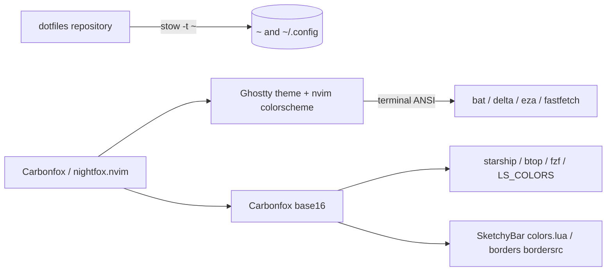

# dotfiles

[](https://github.com/lucawalz/dotfiles/actions/workflows/ci.yaml)
[](LICENSE)


A GNU Stow deployed macOS terminal environment, themed end to end with Carbonfox.

## Description

dotfiles holds the configuration for a single Apple Silicon Mac: the terminal, the shell, the editor, and the desktop furniture around them. Every package is a GNU Stow package, so the files under `~` are symlinks back into this repository and the working copy is the live configuration rather than a snapshot of it.

The environment is Ghostty as the terminal, zsh with starship as the shell, and Neovim as the editor, with btop and fastfetch alongside and AeroSpace, SketchyBar, JankyBorders, and Raycast on the desktop. One palette, Carbonfox, runs through all of them.

### Features

- Stow-deployed packages: editing a file in the repository edits the live configuration, so the two cannot drift apart.
- A single Carbonfox palette applied across Ghostty, starship, btop, Neovim, fzf, `LS_COLORS`, SketchyBar, and JankyBorders.
- Ghostty with split and tab keybindings on the command key, a vendored cursor warp shader, and a background at 0.85 opacity with blur.
- Neovim on lazy.nvim with 46 plugin specification files, Carbonfox through nightfox.nvim as the colorscheme, and a space leader.
- AeroSpace tiling with display-pinned workspaces, native resize and service modes for the rarer window commands, and a single focus gesture that walks Neovim splits, windows, and displays, all with System Integrity Protection left enabled.
- A SketchyBar status bar in Lua through SbarLua and JankyBorders window borders, both driven from the same palette, with Raycast as the launcher.
- A Brewfile that installs every dependency the configurations need, including `stow` itself.
- Secret scanning and shellcheck in CI, with gitleaks rules for age, SOPS, and SSH private keys.

### Background

The repository began as a snapshot. Configuration was copied in by hand, and `~/.config` was never symlinked because the `install.sh` the README documented was never written. Live and repository copies drifted for roughly six months, to the point where 25 Neovim files differed and 18 plugins existed only on the machine. Stow removes the class of problem rather than the instance: with the live files symlinked into the repository, a snapshot step no longer exists to be skipped. That decision is recorded in [ADR 0001](docs/adr/0001-deploy-configs-with-gnu-stow.md).

Carbonfox is generated by [nightfox.nvim](https://github.com/EdenEast/nightfox.nvim) from a single palette, which emits the Neovim colorscheme and matching exports for the terminal and other tools. Tools without a ready-made Carbonfox export name its base16 values directly. That approach is recorded in [ADR 0006](docs/adr/0006-adopt-carbonfox-theme.md).

## Architecture

Each top-level directory is a Stow package whose interior mirrors the path it targets under `~`. Running `stow -t ~ ghostty` links `ghostty/.config/ghostty` to `~/.config/ghostty`; running it for `zsh` links `zsh/.zshrc` to `~/.zshrc`. Stow owns the symlinks, so adding a file to a package and restowing is the whole deployment step.

Carbonfox is generated by nightfox.nvim from one palette file, so the Neovim colorscheme and the bundled Ghostty theme come from the same source and are byte-identical: the terminal and editor cannot drift. Tools with no Carbonfox export, such as starship, btop, fzf, `LS_COLORS`, SketchyBar, and JankyBorders, name Carbonfox's base16 values directly, while bat, delta, eza, and fastfetch inherit the terminal palette. That decision is recorded in [ADR 0006](docs/adr/0006-adopt-carbonfox-theme.md), superseding [ADR 0002](docs/adr/0002-derive-oxocarbon-theming-from-base16.md).



## Requirements

- macOS on Apple Silicon. The configuration is developed against macOS Tahoe and is not portable to Linux as written.
- [Homebrew](https://brew.sh), which installs most dependencies through the [`Brewfile`](Brewfile), including `lua`, `nowplaying-cli` for the SketchyBar media widget, and the Raycast cask.
- GNU Stow, installed by the Brewfile, for deployment.
- A Nerd Font. The Ghostty config asks for JetBrainsMonoNL Nerd Font, and starship and fastfetch depend on the glyphs.
- SF Pro, which SketchyBar renders in. Apple does not ship it through a cask, so it is downloaded from Apple and installed by hand into `~/Library/Fonts`.
- [SbarLua](https://github.com/FelixKratz/SbarLua), the Lua binding SketchyBar loads. Homebrew does not package it, so it is built from source and needs `lua` and `clang` present.

## Installation

Clone the repository to a stable path, since Stow creates symlinks that point back into it and moving it later breaks them.

```
git clone https://github.com/lucawalz/dotfiles.git ~/dotfiles
cd ~/dotfiles
```

The one-command path is `make bootstrap`, which runs `brew bundle`, links every Stow package, and prints the remaining manual steps (building SbarLua, installing SF Pro, and granting Accessibility). To run those stages by hand instead, install the dependencies, then link the packages:

```
brew bundle
stow -t ~ ghostty starship btop fastfetch nvim zsh sketchybar aerospace borders
```

Stow refuses to overwrite a real file that already exists at a target path. Move or delete any pre-existing configuration first, then restow. Verify a link with `ls -l ~/.config/ghostty`, which should resolve into the clone.

SketchyBar loads its Lua binding at startup, which Homebrew does not package. Build SbarLua from source once, with `lua` and `clang` installed:

```
git clone https://github.com/FelixKratz/SbarLua.git /tmp/SbarLua
make -C /tmp/SbarLua install
```

Install SF Pro by hand, since Apple does not distribute it through a cask. Download the font from Apple and copy its files into `~/Library/Fonts`, then let SketchyBar pick it up on the next reload.

Neovim installs its plugins on first launch through lazy.nvim, pinned by [`nvim/.config/nvim/lazy-lock.json`](nvim/.config/nvim/lazy-lock.json).

To remove a package, run `stow -D -t ~ <package>`. To relink after adding files, run `stow -R -t ~ <package>`.

## Usage

After stowing, the configuration is live. Open a new shell to pick up `.zshrc`.

One grammar runs through every layer, so a binding is derived rather than memorised. The modifier names the layer: `cmd` acts inside the current application (Ghostty tabs and splits, close, save), `alt` acts on windows and workspaces (`alt` moves, `alt shift` focuses), `alt shift r` and `alt shift ;` open the resize and service modes for the rarer window operations, `cmd space` opens Raycast to launch, and inside Neovim space leads commands while `ctrl` moves between splits. Directions are always `h j k l`, workspaces and tabs are always digits, `r` always enters a resize mode with the same keys inside, and `b` always balances.

### Ghostty

Splits and tabs are bound to the command key, and split navigation follows vim directions.

| Keybinding | Action |
|-----------|--------|
| `⌘` `t` | New tab |
| `⌘` `n` | New window |
| `⌘` `w` | Close surface |
| `⌘` `1` to `⌘` `9` | Go to tab by number |
| `⌘` `d` | Split right |
| `⌘` `⇧` `d` | Split down |
| `⌘` `⇧` `e` | Equalize splits |
| `⌘` `h` `j` `k` `l` | Go to split left, down, up, right |
| `⌘` `` ` `` | Toggle quick terminal |
| `⌘` `i` | Toggle inspector |

### Neovim

The leader key is space. A selection of the core maps:

| Keybinding | Action |
|-----------|--------|
| `jj` or `jk` | Exit insert mode |
| `<Esc>` | Clear search highlight |
| `<C-s>` | Save file |
| `<C-p>` | Find files with Telescope |
| `<C-h>` `<C-j>` `<C-k>` `<C-l>` | Move between windows |
| `<leader>sv` / `<leader>sh` | Split vertically or horizontally |
| `<leader>sx` | Close split |
| `<leader>sr` | Resize mode: `h` `j` `k` `l` resize, `b` balances, `esc` leaves |
| `<S-h>` / `<S-l>` | Previous or next buffer |
| `<leader>bd` | Delete buffer |
| `<leader>q` / `<leader>Q` | Quit window or quit all |
| `<leader>ut` | Toggle light and dark theme |
| `<C-/>` | Toggle comment |

Plugin-specific maps live next to their specifications under `nvim/.config/nvim/lua/config/plugins/`, and `which-key` lists them at runtime.

### Windows

AeroSpace tiles windows into virtual workspaces, and its own bindings hold the window commands, with two named modes for the rarer ones. Raycast on `cmd space` is the launcher. The modifier is `alt`.

| Keybinding | Action |
|-----------|--------|
| `alt` `h` `j` `k` `l` | Move the window through the layout |
| `alt` `⇧` `h` `j` `k` `l` | Focus left, down, up, right, across Neovim splits, windows, and displays |
| `alt` `1` to `alt` `5` | Focus a workspace |
| `alt` `⇧` `1` to `alt` `⇧` `5` | Send the window to a workspace |
| `alt` `⇥` | Return to the previous workspace |
| `alt` `⇧` `r` | Resize mode |
| `alt` `⇧` `;` | Service mode |
| `⌘` `space` | Open Raycast to launch |

Resize mode maps `h` `j` `k` `l` to resize the focused window, `-` and `=` to resize smart, `b` to balance, and `enter` or `esc` to return to the main mode. Service mode offers join (`h` `j` `k` `l` join with that direction), layout (`t` tiles, `a` accordion, `s` floating), fullscreen (`f`), balance (`b`), flatten (`r`), and config reload (`c`), staying active until `enter` or `esc` returns to the main mode.

Workspaces exist lazily and are pinned to displays, 1, 2, and 3 on the primary and 4 and 5 on the second, so a workspace number always means the same screen. Focus movement crosses Neovim split boundaries through a small RPC bridge, `nvim/lua/config/aerospace-focus.lua` and `aerospace/scripts/focus.sh`, so one gesture walks from a split to the next window to the other display.

AeroSpace needs Accessibility permission, granted through System Settings. The command and option swap for the external keyboard lives in System Settings, Keyboard, Modifier Keys.

### Shell

`.zshrc` sets up fzf-tab completion, atuin history, zoxide, direnv, and starship. `y` opens yazi and changes to the directory it exits in. `ls` is aliased to eza, and `kubectl` and `k` are aliased to kubecolor.

### Desktop

SketchyBar runs as a background service and is started with `brew services start sketchybar`. It reloads with `sketchybar --reload` after a config change. Its configuration is Lua loaded through SbarLua, so the bar, its items, and its event handlers live in `sketchybar/.config/sketchybar/` as Lua files. Every SketchyBar colour comes from `sketchybar/.config/sketchybar/colors.lua`, so a palette change belongs there rather than in an individual item.

SketchyBar draws below the macOS menu bar rather than replacing it. Hiding the system menu bar under System Settings, Control Center, Automatically hide and show the menu bar, leaves a single bar on screen. AeroSpace reserves the strip it occupies through the top outer gap, so tiled windows start below it.

JankyBorders draws a rounded border around the focused window and runs as a background service, started with `brew services start borders`. Its two colours live in `borders/.config/borders/bordersrc`, active in base09 blue and inactive in base02 grey. It needs Accessibility permission, granted under System Settings, Privacy and Security, Accessibility, to track and draw around windows.

## Repository layout

```
ghostty/      Ghostty config, ANSI palette, and cursor warp shader
aerospace/    AeroSpace tiling, workspace pins, gaps, and the focus bridge script
starship/     starship prompt and Carbonfox palette
btop/         btop config and Carbonfox theme
fastfetch/    fastfetch config and dragon logo
nvim/         Neovim config, lazy.nvim plugin specs, and lockfile
zsh/          zsh config, aliases, and tool initialisation
sketchybar/   SketchyBar Lua config, shared palette, and item modules
borders/      JankyBorders window border config
macos/        curated system defaults script, run only on request
Makefile      orchestrates brew, stow, and the bootstrap reminders
Brewfile      Homebrew dependencies for every package above
docs/adr/     architecture decision records
```

## Contributing

This is a personal configuration, but corrections and suggestions are welcome. See [CONTRIBUTING.md](CONTRIBUTING.md) for the setup, branch, and commit conventions. In short: stow the package being changed, verify it against the running tool, then open a PR against `main`; CI scans the tree for secrets.

## Support

Open an issue on the [GitHub repository](https://github.com/lucawalz/dotfiles/issues).

## Authors and acknowledgment

Built and maintained by Luca Walz. The theme is [Carbonfox](https://github.com/EdenEast/nightfox.nvim), the IBM Carbon inspired variant of nightfox.nvim by EdenEast, which supplies both the Neovim colorscheme and the matching terminal palette. The cursor warp shader is vendored from [sahaj-b/ghostty-cursor-shaders](https://github.com/sahaj-b/ghostty-cursor-shaders) under the MIT License, with the original license retained at [`ghostty/.config/ghostty/shaders/LICENSE`](ghostty/.config/ghostty/shaders/LICENSE). The workspace app icons use [sketchybar-app-font](https://github.com/kvndrsslr/sketchybar-app-font) and its generated `icon_map.sh` lookup table.

## License

Released under the MIT License. See [LICENSE](LICENSE).

## Project status

Actively maintained and tracks the machine it runs on.
