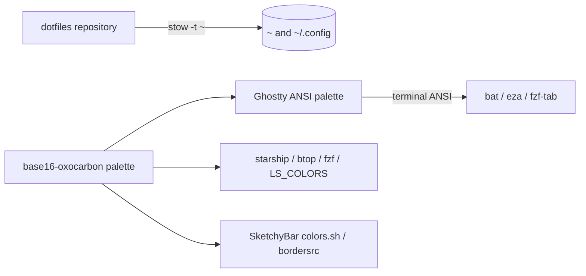

# dotfiles

[](https://github.com/lucawalz/dotfiles/actions/workflows/ci.yaml)
[](LICENSE)


A GNU Stow deployed macOS terminal environment, themed end to end with Oxocarbon.

## Description

dotfiles holds the configuration for a single Apple Silicon Mac: the terminal, the shell, the editor, and the desktop furniture around them. Every package is a GNU Stow package, so the files under `~` are symlinks back into this repository and the working copy is the live configuration rather than a snapshot of it.

The environment is Ghostty as the terminal, zsh with starship as the shell, and Neovim as the editor, with btop and fastfetch alongside and SketchyBar and JankyBorders on the desktop. One palette, the canonical base16 Oxocarbon dark palette, runs through all of them.

### Features

- Stow-deployed packages: editing a file in the repository edits the live configuration, so the two cannot drift apart.
- A single Oxocarbon palette applied across Ghostty, starship, btop, Neovim, fzf, `LS_COLORS`, SketchyBar, and JankyBorders.
- Ghostty with split and tab keybindings on the command key, a vendored cursor warp shader, and a background at 0.85 opacity with blur.
- Neovim on lazy.nvim with 46 plugin specification files, oxocarbon.nvim as the colorscheme, and a space leader.
- A SketchyBar status bar and JankyBorders window borders, both driven from the same palette through a shared `colors.sh`.
- A Brewfile that installs every dependency the configurations need, including `stow` itself.
- Secret scanning and shellcheck in CI, with gitleaks rules for age, SOPS, and SSH private keys.

### Background

The repository began as a snapshot. Configuration was copied in by hand, and `~/.config` was never symlinked because the `install.sh` the README documented was never written. Live and repository copies drifted for roughly six months, to the point where 25 Neovim files differed and 18 plugins existed only on the machine. Stow removes the class of problem rather than the instance: with the live files symlinked into the repository, a snapshot step no longer exists to be skipped. That decision is recorded in [ADR 0001](docs/adr/0001-deploy-configs-with-gnu-stow.md).

Oxocarbon has upstream ports for editors and terminals but not for starship, SketchyBar, or JankyBorders. Those are derived from the canonical [base16-oxocarbon](https://github.com/nyoom-engineering/base16-oxocarbon) dark palette, which keeps a single source of truth for the colors. That decision is recorded in [ADR 0002](docs/adr/0002-derive-oxocarbon-theming-from-base16.md).

## Architecture

Each top-level directory is a Stow package whose interior mirrors the path it targets under `~`. Running `stow -t ~ ghostty` links `ghostty/.config/ghostty` to `~/.config/ghostty`; running it for `zsh` links `zsh/.zshrc` to `~/.zshrc`. Stow owns the symlinks, so adding a file to a package and restowing is the whole deployment step.

Theming flows one way. The base16 Oxocarbon dark palette is the source, Ghostty's config pins the 16 ANSI entries to it, and the tools that read terminal ANSI inherit the palette without further configuration. Tools that carry their own color configuration, such as starship, btop, fzf, SketchyBar, and JankyBorders, name the same hex values directly.



## Requirements

- macOS on Apple Silicon. The configuration is developed against macOS Tahoe and is not portable to Linux as written.
- [Homebrew](https://brew.sh), which installs every other dependency through the [`Brewfile`](Brewfile).
- GNU Stow, installed by the Brewfile, for deployment.
- A Nerd Font. The Ghostty config asks for JetBrainsMonoNL Nerd Font, and starship and fastfetch depend on the glyphs.

## Installation

Clone the repository to a stable path, since Stow creates symlinks that point back into it and moving it later breaks them.

```
git clone https://github.com/lucawalz/dotfiles.git ~/dotfiles
cd ~/dotfiles
```

Install the dependencies, then link the packages:

```
brew bundle
stow -t ~ ghostty starship btop fastfetch nvim zsh sketchybar borders
```

Stow refuses to overwrite a real file that already exists at a target path. Move or delete any pre-existing configuration first, then restow. Verify a link with `ls -l ~/.config/ghostty`, which should resolve into the clone.

Neovim installs its plugins on first launch through lazy.nvim, pinned by [`nvim/.config/nvim/lazy-lock.json`](nvim/.config/nvim/lazy-lock.json).

To remove a package, run `stow -D -t ~ <package>`. To relink after adding files, run `stow -R -t ~ <package>`.

## Usage

After stowing, the configuration is live. Open a new shell to pick up `.zshrc`.

### Ghostty

Splits and tabs are bound to the command key, and split navigation follows vim directions.

| Keybinding | Action |
|-----------|--------|
| `⌘` `t` | New tab |
| `⌘` `n` | New window |
| `⌘` `w` | Close surface |
| `⌘` `1` to `⌘` `9` | Go to tab by number |
| `⌘` `d` | Split right |
| `⌘` `⇧` `d` | Split down |
| `⌘` `⇧` `e` | Equalize splits |
| `⌘` `h` `j` `k` `l` | Go to split left, down, up, right |
| `⌘` `` ` `` | Toggle quick terminal |
| `⌘` `i` | Toggle inspector |

### Neovim

The leader key is space. A selection of the core maps:

| Keybinding | Action |
|-----------|--------|
| `jj` or `jk` | Exit insert mode |
| `<Esc>` | Clear search highlight |
| `<C-s>` | Save file |
| `<C-p>` | Find files with Telescope |
| `<C-h>` `<C-j>` `<C-k>` `<C-l>` | Move between windows |
| `<leader>sv` / `<leader>sh` | Split vertically or horizontally |
| `<leader>sx` | Close split |
| `<S-h>` / `<S-l>` | Previous or next buffer |
| `<leader>bd` | Delete buffer |
| `<leader>q` / `<leader>Q` | Quit window or quit all |
| `<leader>ut` | Toggle light and dark theme |
| `<C-/>` | Toggle comment |

Plugin-specific maps live next to their specifications under `nvim/.config/nvim/lua/config/plugins/`, and `which-key` lists them at runtime.

### Shell

`.zshrc` sets up fzf-tab completion, atuin history, zoxide, direnv, and starship. `y` opens yazi and changes to the directory it exits in. `ls` is aliased to eza, and `kubectl` and `k` are aliased to kubecolor.

### Desktop

SketchyBar and JankyBorders run as background services and are started with `brew services start sketchybar` and `brew services start borders`. SketchyBar reloads with `sketchybar --reload` after a config change. Every SketchyBar colour comes from `sketchybar/.config/sketchybar/colors.sh`, so a palette change belongs there rather than in an individual plugin. JankyBorders takes its two colours as arguments in `borders/.config/borders/bordersrc`, since it has no configuration file of its own.

SketchyBar draws below the macOS menu bar rather than replacing it. Hiding the system menu bar under System Settings, Control Center, Automatically hide and show the menu bar, leaves a single bar on screen.

## Repository layout

```
ghostty/      Ghostty config, ANSI palette, and cursor warp shader
starship/     starship prompt and Oxocarbon palette
btop/         btop config and Oxocarbon theme
fastfetch/    fastfetch config and dragon logo
nvim/         Neovim config, lazy.nvim plugin specs, and lockfile
zsh/          zsh config, aliases, and tool initialisation
sketchybar/   SketchyBar bar config, shared palette, and item plugins
borders/      JankyBorders window border config
Brewfile      Homebrew dependencies for every package above
docs/adr/     architecture decision records
```

## Contributing

This is a personal configuration, but corrections and suggestions are welcome. See [CONTRIBUTING.md](CONTRIBUTING.md) for the setup, branch, and commit conventions. In short: stow the package being changed, verify it against the running tool, then open a PR against `main`; CI scans the tree for secrets.

## Support

Open an issue on the [GitHub repository](https://github.com/lucawalz/dotfiles/issues).

## Authors and acknowledgment

Built and maintained by Luca Walz. The palette is [base16-oxocarbon](https://github.com/nyoom-engineering/base16-oxocarbon) by Nyoom Engineering, and the editor colorscheme is [oxocarbon.nvim](https://github.com/nyoom-engineering/oxocarbon.nvim) from the same authors. The cursor warp shader is vendored from [sahaj-b/ghostty-cursor-shaders](https://github.com/sahaj-b/ghostty-cursor-shaders) under the MIT License, with the original license retained at [`ghostty/.config/ghostty/shaders/LICENSE`](ghostty/.config/ghostty/shaders/LICENSE).

## License

Released under the MIT License. See [LICENSE](LICENSE).

## Project status

Actively maintained and tracks the machine it runs on.
